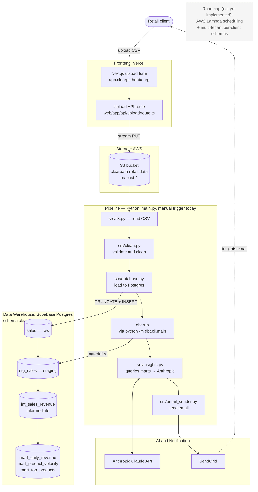

# Clearpath — AI-Powered Retail Insights

Clearpath turns weekly sales CSVs into plain-English business
recommendations for small retail clients. Owners upload a CSV through a
web form; a Python pipeline cleans, transforms, and analyses it; Claude
generates the recommendations; SendGrid emails the report.

## Architecture



A retail client uploads a weekly sales CSV through the Vercel-hosted
Next.js form, which streams it to S3. The Python pipeline (`main.py`
plus the modules under `src/`) reads the CSV, loads it into Supabase
Postgres, builds the dbt marts, asks Claude for plain-English
recommendations, and emails them via SendGrid. The pipeline currently
runs on demand; AWS Lambda scheduling is on the roadmap. An Airflow
DAG in `dags/` exists as an alternative local orchestrator.

- **`web/`** — Next.js 16 upload UI. The form posts to `web/app/api/upload/route.ts`, which streams the CSV to S3 using `@aws-sdk/client-s3`.
- **`dags/clearpath_pipeline.py`** — Airflow DAG that runs every Monday at 08:00. Pulls the latest CSV from S3, cleans it, loads it into SQLite, runs dbt, generates insights, and sends the email.
- **`src/`** — shared Python pipeline modules used by both the DAG and `main.py`:
  - `config.py` — centralised env-var loading and validation
  - `aws.py` — reusable S3 client factory
  - `s3.py`, `clean.py`, `database.py`, `queries.py`, `insights.py`, `email_sender.py`
- **`clearpath_dbt/`** — dbt project (staging → intermediate → marts).
- **`main.py`** — local/manual pipeline runner; useful for testing without Airflow.
- **`data/raw/`** — gitignored landing zone for local CSVs.
- **`data/reference/`** — committed reference data (e.g. `products.csv`).

## Local development

### Prerequisites

- Python 3.12+
- Node.js 20+ and npm
- An AWS account with an S3 bucket
- An Anthropic API key
- A SendGrid account (optional — the email step skips itself if creds are missing)

### Setup

```bash
# Python pipeline
python -m venv .venv
.venv\Scripts\activate          # PowerShell
pip install -r requirements.txt
copy .env.example .env          # then fill in your keys

# Web app
cd web
npm install
npm run dev                     # http://localhost:3000
```

### Start a dev session

After the initial setup, every new shell needs the venv activated and `.env`
loaded into the process environment (`src/config.py` reads `.env` itself, but
`dbt` and other CLI tools read directly from the environment). The
`scripts/start.ps1` helper does both:

```powershell
cd C:\Users\mcast\clearpath
. .\scripts\start.ps1
```

The leading dot (dot-sourcing) is required so the venv activation and the env
vars persist in your shell instead of being scoped to the script's subprocess.
The script prints which env vars are set vs. missing so you know what to fix
before running anything. Once it finishes, you can run:

```powershell
python main.py
python -m dbt.cli.main run
```

### Run a pipeline manually

```bash
python main.py
```

This pulls the latest CSV from S3 for the configured client, runs the
full pipeline, and sends the insights email.

### Run the Airflow DAG

The repo includes a local Airflow setup under `airflow/`. Point
`AIRFLOW_HOME` at that directory (or use your own) and start the
scheduler/web server. The DAG `clearpath_pipeline` will appear in the
UI.

## Environment variables

All env vars are read by `src/config.py`, which loads them from `.env`
at the project root (and from Streamlit secrets if applicable). See
`.env.example` for the full list.

| Variable | Required | Default | Notes |
|---|---|---|---|
| `S3_BUCKET_NAME` | yes | — | Bucket for raw uploads |
| `AWS_ACCESS_KEY_ID` | no | — | Falls back to default boto3 chain (IAM role, profile, etc.) |
| `AWS_SECRET_ACCESS_KEY` | no | — | Same as above |
| `AWS_REGION` | no | `us-east-1` | |
| `SUPABASE_HOST` | yes | — | Supabase Postgres host (typically the pooler endpoint) |
| `SUPABASE_PORT` | no | `5432` | Use `6543` for the connection pooler |
| `SUPABASE_USER` | yes | — | |
| `SUPABASE_PASSWORD` | yes | — | |
| `SUPABASE_DATABASE` | yes | — | Usually `postgres` |
| `CLIENT_NAME` | no | `Juice Bar NYC` | Used by `main.py` |
| `BUSINESS_TYPE` | no | `Juice Bar` | |
| `SENDGRID_API_KEY` | no | — | Email step is skipped if missing |
| `FROM_EMAIL` | no | — | Email step is skipped if missing |
| `REPORT_RECIPIENT_EMAIL` | no | — | Email step is skipped if missing |
| `ANTHROPIC_API_KEY` | yes (for insights) | — | Read by the `anthropic` SDK |

`src/config.py` raises `ConfigError` at import time if `S3_BUCKET_NAME` or any
of the required `SUPABASE_*` vars are missing, so misconfiguration fails fast.
