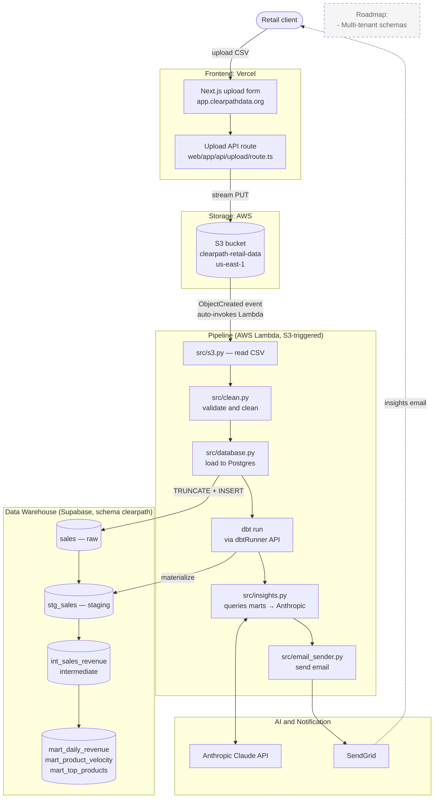

# Clearpath — AI-Powered Retail Insights

Clearpath turns weekly sales CSVs into plain-English business
recommendations for small retail clients. Owners upload a CSV through a
web form; a Python pipeline cleans, transforms, and analyses it; Claude
generates the recommendations; SendGrid emails the report.

> **Two repositories.** Clearpath is split across two repos by responsibility:
> this one (`clearpath`) is the **data system** — the serverless pipeline on AWS
> Lambda, dbt, Claude, and the CSV upload tooling — while the public-facing
> website lives at https://github.com/mccastanedap/clearpath-site. In short, this
> repo handles data processing; the other handles presentation/marketing.

## Architecture



A retail client uploads a weekly sales CSV through the Vercel-hosted
Next.js form, which streams it to S3. The Python pipeline (`main.py`
plus the modules under `src/`) reads the CSV, loads it into Supabase
Postgres, builds the dbt marts, asks Claude for plain-English
recommendations, and emails them via SendGrid. The pipeline runs
automatically: uploading a CSV to S3 fires an S3 `ObjectCreated` event
that invokes a containerized AWS Lambda function (no manual
`python main.py` step in production). An optional Airflow DAG in
`dags/` is available for local development.

The Lambda runs from a Docker image hosted in Amazon ECR, built via AWS
CodeBuild. It accesses S3 through an IAM role attached to the function —
no AWS credentials are hardcoded or stored in environment variables. The
same `src/` modules run locally and inside the Lambda; in the Lambda,
dbt is executed in-process through the `dbtRunner` API rather than the
`python -m dbt.cli.main` CLI.

- **`web/`** — Next.js 16 upload UI. The form posts to `web/app/api/upload/route.ts`, which streams the CSV to S3 using `@aws-sdk/client-s3`.
- **`dags/clearpath_pipeline.py`** — Optional local Airflow DAG that orchestrates the same pipeline as `main.py`. Kept as an alternative scheduler for local development; the production path is the S3-triggered AWS Lambda function.
- **`src/`** — shared Python pipeline modules used by both the DAG and `main.py`:
  - `config.py` — centralised env-var loading and validation
  - `aws.py` — reusable S3 client factory
  - `s3.py`, `clean.py`, `database.py`, `queries.py`, `insights.py`, `email_sender.py`
- **`clearpath_dbt/`** — dbt project (staging → intermediate → marts).
- **`main.py`** — local development entrypoint. Reads the latest CSV from S3, loads it into Supabase Postgres, runs dbt, generates insights with Claude, and emails the report via SendGrid. The production deployment invokes the same `src/` modules from the S3-triggered Lambda handler rather than this script.
- **`data/reference/`** — committed reference data (e.g. `products.csv`).

## Local development

### Prerequisites

- Python 3.12+
- Node.js 20+ and npm
- An AWS account with an S3 bucket
- An Anthropic API key
- A SendGrid account (optional — the email step skips itself if creds are missing)

### Setup

```bash
# Python pipeline
python -m venv .venv
.venv\Scripts\activate          # PowerShell
pip install -r requirements.txt
copy .env.example .env          # then fill in your keys

# Web app
cd web
npm install
npm run dev                     # http://localhost:3000
```

### Start a dev session

After the initial setup, every new shell needs the venv activated and `.env`
loaded into the process environment (`src/config.py` reads `.env` itself, but
`dbt` and other CLI tools read directly from the environment). The
`scripts/start.ps1` helper does both:

```powershell
cd C:\Users\mcast\clearpath
. .\scripts\start.ps1
```

The leading dot (dot-sourcing) is required so the venv activation and the env
vars persist in your shell instead of being scoped to the script's subprocess.
The script prints which env vars are set vs. missing so you know what to fix
before running anything. Once it finishes, you can run:

```powershell
python main.py
python -m dbt.cli.main run
```

### Run the pipeline locally

`python main.py` is the **local development** entrypoint only. In
production the pipeline runs as the S3-triggered AWS Lambda function
described in the Architecture section — you do **not** run `main.py`
manually in production. Use it locally to test the full flow end-to-end:

```bash
python main.py
```

This reads the latest CSV from S3 for the configured client
(set via `CLIENT_NAME` and `BUSINESS_TYPE` env vars), runs the full
pipeline, and sends the insights email to `REPORT_RECIPIENT_EMAIL`.

Optionally, the repo also includes a local Airflow setup under
`airflow/` for development. Point `AIRFLOW_HOME` at that directory
and start the scheduler/web server; the `clearpath_pipeline` DAG
will appear in the UI. This is not required for normal use.

## Environment variables

All env vars are read by `src/config.py`, which loads them from `.env`
at the project root (and from Streamlit secrets if applicable). See
`.env.example` for the full list.

| Variable | Required | Default | Notes |
|---|---|---|---|
| `S3_BUCKET_NAME` | yes | — | Bucket for raw uploads |
| `AWS_ACCESS_KEY_ID` | no | — | Falls back to default boto3 chain (IAM role, profile, etc.) |
| `AWS_SECRET_ACCESS_KEY` | no | — | Same as above |
| `AWS_REGION` | no | `us-east-1` | |
| `SUPABASE_HOST` | yes | — | Supabase Postgres host (typically the pooler endpoint) |
| `SUPABASE_PORT` | no | `5432` | Use `6543` for the connection pooler |
| `SUPABASE_USER` | yes | — | |
| `SUPABASE_PASSWORD` | yes | — | |
| `SUPABASE_DATABASE` | yes | — | Usually `postgres` |
| `CLIENT_NAME` | no | `Juice Bar NYC` | Used by `main.py` |
| `BUSINESS_TYPE` | no | `Juice Bar` | |
| `SENDGRID_API_KEY` | no | — | Email step is skipped if missing |
| `FROM_EMAIL` | no | — | Email step is skipped if missing |
| `REPORT_RECIPIENT_EMAIL` | no | — | Email step is skipped if missing |
| `ANTHROPIC_API_KEY` | yes (for insights) | — | Read by the `anthropic` SDK |

`src/config.py` raises `ConfigError` at import time if `S3_BUCKET_NAME` or any
of the required `SUPABASE_*` vars are missing, so misconfiguration fails fast.

## Roadmap

The current MVP runs end-to-end with a single retail client. The next
phases focus on automation, isolation, and operational reliability:

### Pipeline automation
- Notification to the client once their report has been generated.

### Multi-tenant
- Add `tenant_id` to `clearpath.sales` so multiple clients can use the
  same warehouse safely.
- Per-client routing of insights (each client receives only their own
  report).
- Per-client schemas in Supabase for clients requiring stronger
  isolation guarantees.

### Data quality
- Schema validation on CSV upload (pydantic or pandera) to reject
  malformed files with a clear error before they reach the pipeline.
- Automated tests for the Python pipeline modules (`clean.py`,
  `database.py`) in addition to the existing dbt tests.

### Customer experience
- Authenticated upload flow with Supabase Auth (signup, login,
  per-client identity).
- Self-service onboarding for approved early-access clients.
- Dashboard view of past reports.
