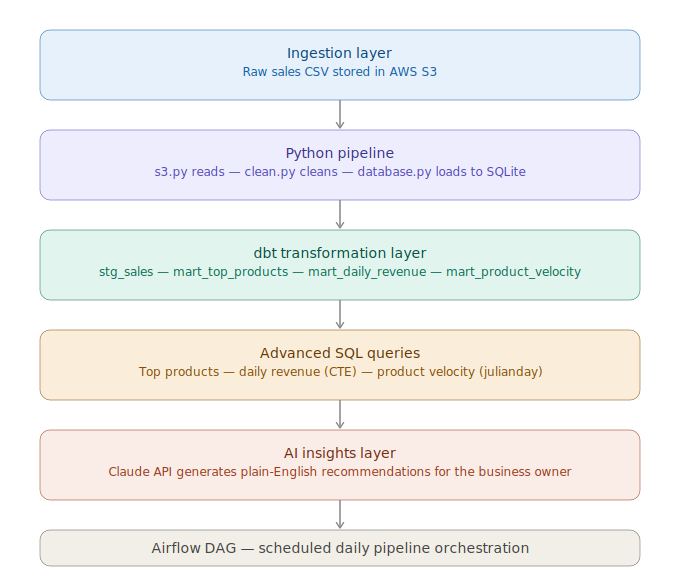

# Clearpath — AI-Powered Retail Insights

An end-to-end data pipeline that transforms raw sales data 
into plain-English business recommendations for small retail clients.

## What it does
- Cleans and validates raw sales CSV data
- Loads clean data into a SQLite database
- Runs advanced SQL queries for inventory and revenue analysis
- Generates AI-powered insights using the Claude API

## Tech stack
- Python / pandas
- AWS S3
- SQLite
- dbt Core
- Apache Airflow
- Claude API (Anthropic)

## How to run
1. Clone the repo
2. Install dependencies: `pip install -r requirements.txt`
3. Add your Anthropic API key to a `.env` file: `ANTHROPIC_API_KEY=your-key-here`
4. Add a sales CSV to `data/raw/sales.csv`
5. Run the pipeline: `python main.py`

## Project structure
- `src/clean.py` — data cleaning and validation
- `src/database.py` — SQLite connection and loading
- `src/queries.py` — advanced SQL queries
- `src/insights.py` — Claude API integration
- `main.py` — pipeline orchestration

## Architecture

